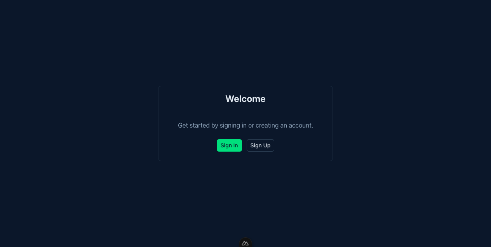
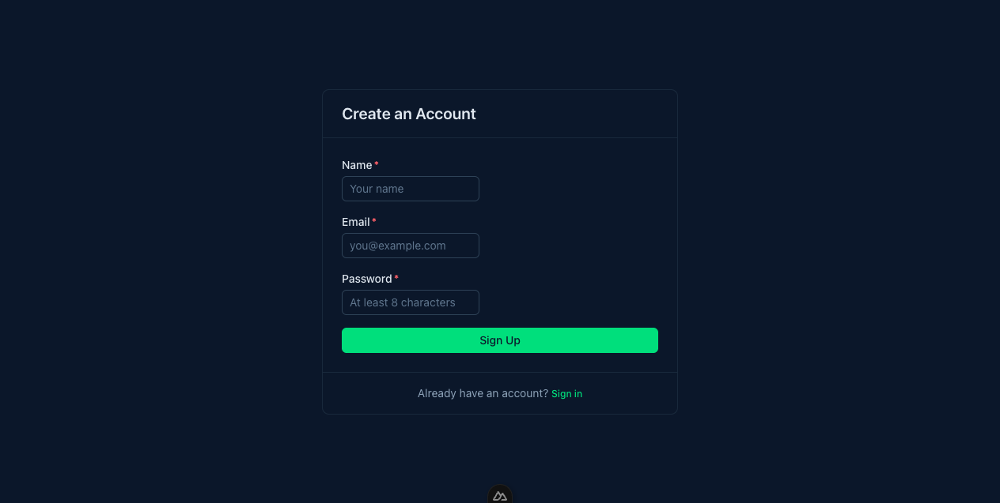

Authentication is one of those features every serious web application needs, yet it remains one of the most tedious to implement correctly. Session management, CSRF protection, secure password hashing, OAuth flows, database schema — the surface area is large, and the stakes are high.

For Nuxt developers, the landscape has shifted over the past couple of years. Lucia Auth deprecated itself. Auth.js (NextAuth) has a Nuxt integration, but its callback-heavy configuration model can feel foreign in a Nuxt codebase. Meanwhile, a newer library called [Better Auth](https://better-auth.com/) has gained serious traction by offering a TypeScript-first, framework-agnostic approach with built-in support for features that other libraries treat as afterthoughts — two-factor authentication, organization management, rate limiting, and more.

In this article, we'll walk through integrating Better Auth into a Nuxt application from scratch. By the end, you'll have working email/password authentication, social login with GitHub, SSR-safe sessions, protected routes, and a clear path to extend the setup with plugins.

## Why Better Auth?

Before diving into code, it's worth understanding what sets Better Auth apart:

- **TypeScript-first**: Every API is fully typed. The client methods, server utilities, and plugin interfaces all provide strong type inference without manual type declarations.
- **Framework-agnostic with first-class Nuxt support**: Better Auth works with any JavaScript backend, but its [Nuxt integration](https://better-auth.com/docs/integrations/nuxt) is well-documented and feels native to the framework.
- **Plugin architecture**: Need two-factor auth? Add the `twoFactor()` plugin. Need organization/team management? There's a plugin for that too. Over 27 plugins are available, and each one extends both the server and client APIs automatically.
- **Database flexibility**: It works with raw SQL drivers (SQLite, PostgreSQL, MySQL), ORMs like Drizzle and Prisma, or even MongoDB. An included CLI generates and runs migrations for you.
- **Built-in security defaults**: Secure password hashing, CSRF protection, rate limiting, and session management are handled out of the box.

## Project Setup

Let's start with a fresh Nuxt project. If you already have one, skip to the next section.

```bash
npx nuxi init nuxt-better-auth
cd nuxt-better-auth
npm install
```

Add [Nuxt UI](https://ui.nuxt.com/) for a consistent, accessible component set (buttons, inputs, cards, alerts). Install the module and Tailwind CSS:

```bash
npm install @nuxt/ui tailwindcss
```

Register the module and add the required CSS in `nuxt.config.ts`:

```typescript
export default defineNuxtConfig({
  modules: ["@nuxt/ui"],
  css: ["~/assets/css/main.css"],
});
```

Create `assets/css/main.css`:

```css
@import "tailwindcss";
@import "@nuxt/ui";
```

Wrap your app with `UApp` in `app.vue` so Toasts and other overlays work correctly:

```vue
<template>
  <UApp>
    <NuxtPage />
  </UApp>
</template>
```

With Nuxt UI and the root layout in place, your app will show a welcome screen with Sign In and Sign Up actions:



Now install Better Auth and a database driver. We'll use `better-sqlite3` for simplicity — it requires zero configuration and stores everything in a local file. For production, you'd swap this for PostgreSQL, MySQL, or a cloud database like Turso.

```bash
npm install better-auth better-sqlite3
npm install -D @types/better-sqlite3
```

Add two environment variables to your `.env` file:

```bash
BETTER_AUTH_SECRET=your-secret-key-at-least-32-characters-long
BETTER_AUTH_URL=http://localhost:3000
```

You can generate a strong secret with `openssl rand -base64 32`.

## Configuring the Auth Instance

Create a file at `server/utils/auth.ts`. This is where you define your Better Auth instance — the database connection, authentication methods, and any plugins you want to use.

```typescript
import { betterAuth } from "better-auth";
import Database from "better-sqlite3";

export const auth = betterAuth({
  database: new Database("./sqlite.db"),
  emailAndPassword: {
    enabled: true,
  },
});
```

This minimal configuration gives you a fully functional email/password auth system. Better Auth handles password hashing (using scrypt by default), session token generation, CSRF protection, and cookie management.

### Creating the Database Tables

Better Auth includes a CLI that generates the required database tables. Since our auth instance lives at `server/utils/auth.ts` (not at the project root), pass the config path explicitly:

```bash
npx @better-auth/cli migrate --config ./server/utils/auth.ts
```

This creates the `user`, `session`, `account`, and `verification` tables. Whenever you add plugins later, re-running this command will create any additional tables they require.

If you prefer to generate a migration file instead of applying changes directly, use:

```bash
npx @better-auth/cli generate --config ./server/utils/auth.ts
```

## Mounting the API Handler

Better Auth needs a catch-all API route to handle authentication requests. Create `server/api/auth/[...all].ts`:

```typescript
import { auth } from "~/server/utils/auth";

export default defineEventHandler((event) => {
  return auth.handler(toWebRequest(event));
});
```

This single route handles every auth endpoint — sign-up, sign-in, sign-out, session retrieval, OAuth callbacks, and any endpoints added by plugins. The `toWebRequest` helper converts Nuxt's event into a standard Web Request that Better Auth understands.

## Creating the Auth Client

On the client side, Better Auth provides a Vue-specific client with reactive composables. Create `lib/auth-client.ts`:

```typescript
import { createAuthClient } from "better-auth/vue";

export const authClient = createAuthClient();
```

Since the auth server runs on the same domain, you don't need to specify a `baseURL`. The client automatically calls `/api/auth/*` endpoints.

You can also destructure specific methods if you prefer a more explicit import style:

```typescript
export const { signIn, signUp, signOut, useSession } = createAuthClient();
```

## Building a Sign-Up Page

Create `pages/register.vue` using Nuxt UI's `UCard`, `UFormField`, `UInput`, `UButton`, and `UAlert`:

```html
<script setup lang="ts">
  import { authClient } from "~/lib/auth-client";

  const name = ref("");
  const email = ref("");
  const password = ref("");
  const error = ref("");
  const loading = ref(false);

  async function handleSignUp() {
    error.value = "";
    loading.value = true;

    const { error: signUpError } = await authClient.signUp.email({
      name: name.value,
      email: email.value,
      password: password.value,
    });

    if (signUpError) {
      error.value = signUpError.message ?? "Something went wrong";
      loading.value = false;
      return;
    }

    navigateTo("/dashboard");
  }
</script>

<template>
  <div class="flex min-h-screen items-center justify-center p-4">
    <UCard class="w-full max-w-md">
      <template #header>
        <h1 class="text-xl font-semibold">Create an Account</h1>
      </template>

      <form class="space-y-4" @submit.prevent="handleSignUp">
        <UAlert
          v-if="error"
          color="error"
          variant="soft"
          :description="error"
          icon="i-lucide-circle-alert"
        />

        <UFormField label="Name" required>
          <UInput
            v-model="name"
            type="text"
            placeholder="Your name"
            size="md"
            required
          />
        </UFormField>

        <UFormField label="Email" required>
          <UInput
            v-model="email"
            type="email"
            placeholder="you@example.com"
            size="md"
            required
          />
        </UFormField>

        <UFormField label="Password" required>
          <UInput
            v-model="password"
            type="password"
            placeholder="At least 8 characters"
            size="md"
            required
          />
        </UFormField>

        <UButton
          type="submit"
          block
          size="md"
          :loading="loading"
          :trailing="false"
        >
          {{ loading ? "Creating account..." : "Sign Up" }}
        </UButton>
      </form>

      <template #footer>
        <p class="text-center text-sm text-muted">
          Already have an account?
          <UButton to="/login" variant="link" size="sm" class="p-0">
            Sign in
          </UButton>
        </p>
      </template>
    </UCard>
  </div>
</template>
```

The `signUp.email` method sends the user's credentials to the server, creates the account, hashes the password, and — by default — automatically signs the user in. After a successful sign-up, we use Nuxt's `navigateTo` to redirect to the dashboard. Note that `callbackURL` is designed for OAuth/redirect-based flows and won't trigger a client-side navigation for email/password auth — that's why we handle the redirect manually.


## Building a Login Page

Create `pages/login.vue` with the same Nuxt UI patterns:

```html
<script setup lang="ts">
  import { authClient } from "~/lib/auth-client";

  const email = ref("");
  const password = ref("");
  const error = ref("");
  const loading = ref(false);

  async function handleSignIn() {
    error.value = "";
    loading.value = true;

    const { error: signInError } = await authClient.signIn.email({
      email: email.value,
      password: password.value,
    });

    if (signInError) {
      error.value = signInError.message ?? "Invalid credentials";
      loading.value = false;
      return;
    }

    navigateTo("/dashboard");
  }
</script>

<template>
  <div class="flex min-h-screen items-center justify-center p-4">
    <UCard class="w-full max-w-md">
      <template #header>
        <h1 class="text-xl font-semibold">Sign In</h1>
      </template>

      <form class="space-y-4" @submit.prevent="handleSignIn">
        <UAlert
          v-if="error"
          color="error"
          variant="soft"
          :description="error"
          icon="i-lucide-circle-alert"
        />

        <UFormField label="Email" required>
          <UInput
            v-model="email"
            type="email"
            placeholder="you@example.com"
            size="md"
            required
          />
        </UFormField>

        <UFormField label="Password" required>
          <UInput
            v-model="password"
            type="password"
            placeholder="Your password"
            size="md"
            required
          />
        </UFormField>

        <UButton
          type="submit"
          block
          size="md"
          :loading="loading"
          :trailing="false"
        >
          {{ loading ? "Signing in..." : "Sign In" }}
        </UButton>
      </form>

      <template #footer>
        <p class="text-center text-sm text-muted">
          Don't have an account?
          <UButton to="/register" variant="link" size="sm" class="p-0">
            Sign up
          </UButton>
        </p>
      </template>
    </UCard>
  </div>
</template>
```


## Working with Sessions

### Client-Side Sessions

Better Auth's Vue client provides a reactive `useSession` composable that updates automatically when the auth state changes. With Nuxt UI you can render loading, authenticated, and unauthenticated states using `USkeleton`, `UCard`, and `UButton`:

```html
<script setup lang="ts">
  import { authClient } from "~/lib/auth-client";

  const session = authClient.useSession();
</script>

<template>
  <div v-if="session.isPending">
    <USkeleton class="h-8 w-48" />
  </div>
  <UCard v-else-if="session.data" class="max-w-md">
    <template #header>
      <p class="font-medium">Welcome, {{ session.data.user.name }}</p>
    </template>
    <UButton color="neutral" variant="outline" @click="authClient.signOut()">
      Sign Out
    </UButton>
  </UCard>
  <div v-else>
    <UButton to="/login" size="md"> Sign In </UButton>
  </div>
</template>
```

The `useSession` composable returns a reactive object with `data` (the session and user), `isPending` (loading state), and `error` (if the session fetch failed). When the user signs out, `data` becomes `null` and your UI updates immediately.



### SSR-Safe Sessions

If your Nuxt app uses server-side rendering, you'll want the session to be available during the initial render. Pass Nuxt's `useFetch` to `useSession` so it fetches the session on the server and hydrates it on the client:

```html
<script setup lang="ts">
  import { authClient } from "~/lib/auth-client";

  const { data: session } = await authClient.useSession(useFetch);
</script>

<template>
  <p v-if="session" class="text-default">Welcome, {{ session.user.name }}</p>
</template>
```

This avoids the flash of unauthenticated content that happens when session data is only fetched client-side.

### Server-Side Sessions

On the server, you can access the session through the `auth.api` object. This is useful for server routes, API endpoints, and server middleware:

```typescript
// server/api/me.get.ts
import { auth } from "~/server/utils/auth";

export default defineEventHandler(async (event) => {
  const session = await auth.api.getSession({
    headers: event.headers,
  });

  if (!session) {
    throw createError({ statusCode: 401, message: "Unauthorized" });
  }

  return {
    user: session.user,
  };
});
```

## Protecting Routes with Middleware

Nuxt middleware is the natural place to enforce authentication requirements. Create `middleware/auth.global.ts` for a global middleware that protects specific routes:

```typescript
export default defineNuxtRouteMiddleware(async (to) => {
  const { data: session } = await useFetch("/api/auth/get-session", {
    headers: useRequestHeaders(),
    default: () => null,
  });

  const protectedRoutes = ["/dashboard", "/settings", "/profile"];
  const isProtected = protectedRoutes.some((route) =>
    to.path.startsWith(route),
  );

  if (isProtected && !session.value) {
    return navigateTo("/login");
  }

  const authRoutes = ["/login", "/register"];
  if (authRoutes.includes(to.path) && session.value) {
    return navigateTo("/dashboard");
  }
});
```

This middleware calls Better Auth's session endpoint directly via `useFetch`. We pass `useRequestHeaders()` so that cookies are forwarded during SSR, and `default: () => null` to avoid Nuxt's SSR warning about undefined return values. The middleware does two things: it redirects unauthenticated users away from protected pages, and it redirects authenticated users away from the login and registration pages.

## Adding Social Login

Better Auth supports 33+ OAuth providers. Let's add GitHub as an example.

### Server Configuration

Update your auth instance in `server/utils/auth.ts`:

```typescript
import { betterAuth } from "better-auth";
import Database from "better-sqlite3";

export const auth = betterAuth({
  database: new Database("./sqlite.db"),
  emailAndPassword: {
    enabled: true,
  },
  socialProviders: {
    github: {
      clientId: process.env.GITHUB_CLIENT_ID as string,
      clientSecret: process.env.GITHUB_CLIENT_SECRET as string,
    },
  },
});
```

Add the GitHub OAuth credentials to your `.env` file:

```bash
GITHUB_CLIENT_ID=your-github-client-id
GITHUB_CLIENT_SECRET=your-github-client-secret
```

To get these credentials, create an OAuth App in your [GitHub Developer Settings](https://github.com/settings/developers). Set the authorization callback URL to `http://localhost:3000/api/auth/callback/github`.

### Client Usage

Add a social sign-in button to your login page using Nuxt UI's `UButton` with an icon. You can place it above or below the email form inside the same `UCard`:

```html
<script setup lang="ts">
  import { authClient } from "~/lib/auth-client";

  async function signInWithGitHub() {
    await authClient.signIn.social({
      provider: "github",
      callbackURL: "/dashboard",
    });
  }
</script>

<template>
  <UButton
    block
    color="neutral"
    variant="outline"
    size="md"
    icon="i-lucide-github"
    @click="signInWithGitHub"
  >
    Continue with GitHub
  </UButton>
</template>
```

That's it. Better Auth handles the full OAuth flow — redirecting to GitHub, exchanging the authorization code for tokens, creating or linking the user account, and establishing the session.

Adding another provider like Google follows the same pattern:

```typescript
socialProviders: {
  github: {
    clientId: process.env.GITHUB_CLIENT_ID as string,
    clientSecret: process.env.GITHUB_CLIENT_SECRET as string,
  },
  google: {
    clientId: process.env.GOOGLE_CLIENT_ID as string,
    clientSecret: process.env.GOOGLE_CLIENT_SECRET as string,
  },
},
```

## Extending with Plugins

Better Auth's plugin system is where it really shines. Plugins extend both the server and client APIs with full type safety — once you add a plugin, its methods appear in autocomplete without any extra configuration.

### Two-Factor Authentication

Adding 2FA is a good example of how plugins work. First, add the plugin to your server auth instance:

```typescript
import { betterAuth } from "better-auth";
import { twoFactor } from "better-auth/plugins";
import Database from "better-sqlite3";

export const auth = betterAuth({
  database: new Database("./sqlite.db"),
  emailAndPassword: {
    enabled: true,
  },
  plugins: [twoFactor()],
});
```

Run the migration to create the required table:

```bash
npx @better-auth/cli migrate --config ./server/utils/auth.ts
```

Then add the client plugin to `lib/auth-client.ts`:

```typescript
import { createAuthClient } from "better-auth/vue";
import { twoFactorClient } from "better-auth/client/plugins";

export const authClient = createAuthClient({
  plugins: [
    twoFactorClient({
      twoFactorPage: "/two-factor",
    }),
  ],
});
```

Now the client exposes methods like `authClient.twoFactor.enable()`, `authClient.twoFactor.disable()`, and `authClient.twoFactor.verifyTOTP()`. If a user with 2FA enabled signs in, they're automatically redirected to the page you specified in `twoFactorPage`.

### Other Notable Plugins

The plugin ecosystem covers a wide range of authentication needs:

| Plugin           | What It Does                                   |
| ---------------- | ---------------------------------------------- |
| **organization** | Team/org management with roles and invitations |
| **magicLink**    | Passwordless email authentication              |
| **passkey**      | WebAuthn/passkey support                       |
| **emailOTP**     | One-time passwords sent via email              |
| **admin**        | User management dashboard utilities            |
| **apiKey**       | API key generation and validation              |

Each plugin follows the same pattern: add it to the server, run the migration, add the client counterpart, and the new APIs are available with full type inference.

## The Nuxt Better Auth Module

If you want an even more integrated experience, the community-built [`@onmax/nuxt-better-auth`](https://better-auth.nuxt.dev/) module wraps Better Auth into a proper Nuxt module. It's currently in alpha, but it offers some compelling features:

- **Declarative route protection** via `routeRules` in your Nuxt config
- **Auto schema generation** so you never need to run migrations manually
- **SSR-safe `useUserSession` composable** that works without passing `useFetch`
- **Automatic API route mounting** so you don't need to create the catch-all handler

```typescript
// nuxt.config.ts
export default defineNuxtConfig({
  modules: ["@onmax/nuxt-better-auth"],
  routeRules: {
    "/dashboard/**": { auth: "user" },
    "/admin/**": { auth: "admin" },
  },
});
```

The module is worth watching as it matures. For production applications today, the manual integration described in this article gives you full control and avoids depending on alpha-stage software.

## Production Considerations

Before deploying, keep a few things in mind:

**Switch to a production database.** SQLite is great for development, but you'll want PostgreSQL, MySQL, or a managed solution like Turso for production. Better Auth supports them all — just swap the database driver:

```typescript
import { betterAuth } from "better-auth";
import { Pool } from "pg";

export const auth = betterAuth({
  database: new Pool({
    connectionString: process.env.DATABASE_URL,
  }),
  // ...
});
```

**Use Drizzle or Prisma for larger projects.** If your application already uses an ORM, Better Auth has built-in adapters for both:

```typescript
import { betterAuth } from "better-auth";
import { drizzleAdapter } from "better-auth/adapters/drizzle";
import { db } from "./db";

export const auth = betterAuth({
  database: drizzleAdapter(db, {
    provider: "pg",
  }),
  // ...
});
```

**Set your `BETTER_AUTH_URL` correctly.** In production, this should be your application's public URL. Better Auth uses it for OAuth redirects and cookie configuration.

**Rotate secrets safely.** If you ever need to change your `BETTER_AUTH_SECRET`, use the `BETTER_AUTH_SECRETS` (plural) environment variable to provide both the old and new secrets during the transition period. This ensures existing sessions remain valid while new ones use the updated secret.

## Wrapping Up

Better Auth hits a sweet spot for Nuxt authentication. The core setup is straightforward — a server instance, a catch-all API route, and a client — but the plugin system means you're never boxed in. When requirements grow to include 2FA, team management, or API keys, you add a plugin instead of rearchitecting your auth layer.

The key pieces we covered:

1. **Nuxt UI** for consistent forms and UI (UCard, UFormField, UInput, UButton, UAlert)
2. **Server auth instance** at `server/utils/auth.ts` with database and auth method configuration
3. **Catch-all API route** at `server/api/auth/[...all].ts` to handle all auth endpoints
4. **Vue client** at `lib/auth-client.ts` with reactive session management
5. **SSR-safe sessions** by passing `useFetch` to `useSession`
6. **Route protection** with Nuxt middleware
7. **Social login** with minimal configuration
8. **Plugin system** for extending functionality

For further reading, the [Better Auth documentation](https://better-auth.com/docs) is thorough and well-organized. The [official Nuxt example](https://stackblitz.com/github/better-auth/examples/tree/main/nuxt-example) on StackBlitz is a good hands-on starting point, and [Sébastien Chopin's NuxtHub + Better Auth demo](https://github.com/atinux/nuxthub-better-auth) shows how the setup works with Cloudflare D1 and KV for edge deployment.

If you're looking to deepen your Nuxt skills beyond authentication, check out our [Nuxt.js courses at Vue School](https://vueschool.io/courses) — from fundamentals to advanced patterns like server routes, middleware, and full-stack application architecture.
